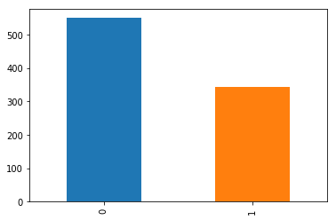
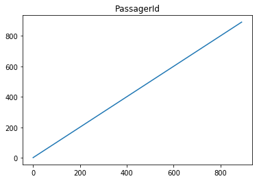
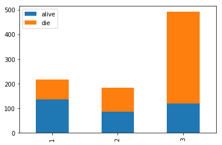
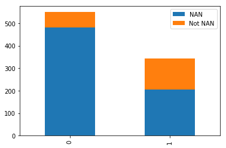
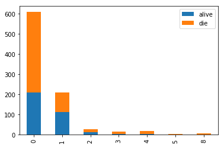

# 数据分析—泰坦尼克之灾

[@seanlee](https://github.com/SeanLee97)

目录：
1. 加载数据，分析数据
2. 数据清洗
3. 特征工程
4. 模型预测

## 1. 加载数据，分析数据的组成


```python
import warnings
warnings.filterwarnings("ignore")

import re
import numpy as np
import pandas as pd
import matplotlib.pyplot as plt
import random as rd
```


```python
df = pd.read_csv('./data/train.csv')
# 输出数据信息
print(df.info())
```

    <class 'pandas.core.frame.DataFrame'>
    RangeIndex: 891 entries, 0 to 890
    Data columns (total 12 columns):
    PassengerId    891 non-null int64
    Survived       891 non-null int64
    Pclass         891 non-null int64
    Name           891 non-null object
    Sex            891 non-null object
    Age            714 non-null float64
    SibSp          891 non-null int64
    Parch          891 non-null int64
    Ticket         891 non-null object
    Fare           891 non-null float64
    Cabin          204 non-null object
    Embarked       889 non-null object
    dtypes: float64(2), int64(5), object(5)
    memory usage: 83.6+ KB
    None


可以看到，数据总共有12个属性，分别是
1. 'PassengerId': 乘客编号
2. 'Survived'： 是否存活（1存活，0死亡）
3. 'Pclass'： 客舱等级 （1， 2， 3）
4. 'Name'： 乘客姓名
5. 'Sex'： 乘客性别
6. 'Age'： 乘客年龄 
7. 'SibSp'： 乘客兄弟姐妹/配偶数
8. 'Parch'： 乘客父母/子女数
9. 'Ticket': 船票号
9. 'Fare'： 船票价格
10. 'Cabin'： 舱号
11. 'Embarked'：登陆港口

得到属性后我们关心的是找到和用户存活相关的属性，也就是哪些属性影响Survived属性。

从给出的info表看到，存在数据缺失的情况，如：**Age, Cabin, Embarked**，**往往数据缺失的部分是提高整个模型的准确率的关键**，我们要做的是挖掘出丢失的数据，将其影响加入到结果预测中

### 1.1 先看值的分布


```python
df.describe()
```


<div>
<style scoped>
    .dataframe tbody tr th:only-of-type {
        vertical-align: middle;
    }

    .dataframe tbody tr th {
        vertical-align: top;
    }

    .dataframe thead th {
        text-align: right;
    }
</style>
<table border="1" class="dataframe">
  <thead>
    <tr style="text-align: right;">
      <th></th>
      <th>PassengerId</th>
      <th>Survived</th>
      <th>Pclass</th>
      <th>Age</th>
      <th>SibSp</th>
      <th>Parch</th>
      <th>Fare</th>
    </tr>
  </thead>
  <tbody>
    <tr>
      <th>count</th>
      <td>891.000000</td>
      <td>891.000000</td>
      <td>891.000000</td>
      <td>714.000000</td>
      <td>891.000000</td>
      <td>891.000000</td>
      <td>891.000000</td>
    </tr>
    <tr>
      <th>mean</th>
      <td>446.000000</td>
      <td>0.383838</td>
      <td>2.308642</td>
      <td>29.699118</td>
      <td>0.523008</td>
      <td>0.381594</td>
      <td>32.204208</td>
    </tr>
    <tr>
      <th>std</th>
      <td>257.353842</td>
      <td>0.486592</td>
      <td>0.836071</td>
      <td>14.526497</td>
      <td>1.102743</td>
      <td>0.806057</td>
      <td>49.693429</td>
    </tr>
    <tr>
      <th>min</th>
      <td>1.000000</td>
      <td>0.000000</td>
      <td>1.000000</td>
      <td>0.420000</td>
      <td>0.000000</td>
      <td>0.000000</td>
      <td>0.000000</td>
    </tr>
    <tr>
      <th>25%</th>
      <td>223.500000</td>
      <td>0.000000</td>
      <td>2.000000</td>
      <td>20.125000</td>
      <td>0.000000</td>
      <td>0.000000</td>
      <td>7.910400</td>
    </tr>
    <tr>
      <th>50%</th>
      <td>446.000000</td>
      <td>0.000000</td>
      <td>3.000000</td>
      <td>28.000000</td>
      <td>0.000000</td>
      <td>0.000000</td>
      <td>14.454200</td>
    </tr>
    <tr>
      <th>75%</th>
      <td>668.500000</td>
      <td>1.000000</td>
      <td>3.000000</td>
      <td>38.000000</td>
      <td>1.000000</td>
      <td>0.000000</td>
      <td>31.000000</td>
    </tr>
    <tr>
      <th>max</th>
      <td>891.000000</td>
      <td>1.000000</td>
      <td>3.000000</td>
      <td>80.000000</td>
      <td>8.000000</td>
      <td>6.000000</td>
      <td>512.329200</td>
    </tr>
  </tbody>
</table>
</div>


descibe() 给出了总数，均值，标准值等数据，看了头有点晕吧，好吧这里我们只是大概看一下值的范围，最后的数值的规整化才会用到

## 2. 数据的清洗

接下来逐个揭开数据的面纱！

### Survived

让我们先看看存活占比吧


```python
df.Survived.value_counts().plot(kind='bar')
print(df.Survived.value_counts().values)
plt.show()
```

    [549 342]





### PassengerId

乘客编号，一般来说编号是顺序生成的，如果是顺序生成的话，那么数据就没有多大的意义。

但是也有其他情况，比如银行排号，金、银、普卡的编号一般是不一样的，如果是按照这种方式说明PassagerId中包含了不同等级人群(感觉有点用词不当)的含义，所以一般是按区间来处理。到底属于哪种呢？我们先分析分析


```python
plt.title('PassagerId')
plt.plot(df.PassengerId)
plt.show()
```





好吧，可以看到编号是顺序生成的，所以，我们先放下这个属性

### Pclass

Pclass是舱位的等级，就好比飞机分头等舱，商务舱，普通。一般来说越高级的舱位提供的安全措施可能会比较到位，所以这应该是一个影响因素，到底是不是呢？让我们分析分析再下定论


```python
plt.title('Pclass')
plt.xlabel('class')
plt.ylabel('persons')
print(df.Pclass.value_counts())
df.Pclass.value_counts().plot(kind='bar')
plt.show()
```

    3    491
    1    216
    2    184
    Name: Pclass, dtype: int64


上面是各舱位人数分布。现在让我看看各舱位存活人数


```python
fig = plt.figure()
alive = df.Pclass[df.Survived == 1].value_counts()
die = df.Pclass[df.Survived == 0].value_counts()
print('alive')
print(alive.values)
print('die')
print(die.values)
_df = pd.DataFrame({'alive': alive, 'die': die})
_df.plot(kind='bar', stacked=True)
plt.show()
```

    alive
    [136 119  87]
    die
    [372  97  80]


    <matplotlib.figure.Figure at 0x7f7fc905b978>





可以看到3中死亡占比最高，1最少，3应该是普通舱，1应该是贵宾舱，所以舱位等级对存活造成影响

### Cabbin

舱号缺失比较严重， 先分析舱号缺失和不缺失存活占比


```python
cabin_notnull = df.Survived[pd.notnull(df.Cabin)].value_counts()
cabin_null = df.Survived[pd.isnull(df.Cabin)].value_counts()

_df = pd.DataFrame({'Not NAN': cabin_notnull, 'NAN': cabin_null})
_df.plot(kind='bar', stacked=True)
plt.show()
```





可以看到死亡的乘客中丢失舱号的占大多数，从直观上可以认为舱号数据是否丢失与存活有关联，但由于舱号大部分缺失，未知性太多，一些内部的关系不能得到确定，所以这个属性还得需要挖掘。


### Embarked

登陆港口和存活率分析


```python
alive = df.Embarked[df.Survived == 1].value_counts()
die = df.Embarked[df.Survived == 0].value_counts()

_df = pd.DataFrame({'alive': alive, 'die': die})
_df.plot(kind='bar', stacked = True)
plt.show()
```


可以看到登陆港口和存活率还是有一定关联的，而且登陆港口数据存在部分缺失，我们应该要挖掘缺失的部分的影响

### Name 

因为男生女生的姓名一般不同，给一个姓名大多数情况下可以分辨出性别。虽然分出了性别，但是Miss和Mrs.都是female称呼不同可能年龄也不同，而年龄又存在部分缺失，因此我们需要将名字考虑在内。具体的处理在特征工程部分给出。
名字中都含有Mrs, Miss, Mr这些标识性别的关键词，其实也就是直接给出了性别，所以Name属性的价值可以认为归到了Sex上

### Age


```python
fig = plt.figure(figsize=(16, 4))

plt.subplot2grid((1, 3),(0, 0))
plt.title('age & survived')
plt.xlabel('age')
plt.ylabel('survived')
plt.yticks([0,1])
plt.scatter(df.Age, df.Survived)

# 各年龄分布
plt.subplot2grid((1, 3), (0, 1))
age_0_20 = len(df.Age[(df.Age.values >= 0) & (df.Age.values < 20)])
age_20_40 = len(df.Age[(df.Age.values >= 20) & (df.Age.values < 40)])
age_40_ = len(df.Age[(df.Age.values >= 40)])
age_list = (age_0_20,age_20_40,age_40_)
plt.title('age range')
plt.ylabel('persons')
plt.xlabel('age')
plt.xticks((0,1, 2),('<20','20~40', '>=40'))
plt.bar(left=(0,1,2),height=age_list, align='center', color=('blue', 'orange', 'green'))

# 各等级年龄分布
plt.subplot2grid((1, 3), (0, 2))
line1 = df.Age[df.Pclass==1].plot(kind='kde')
line2 = df.Age[df.Pclass==2].plot(kind='kde')
line3 = df.Age[df.Pclass==3].plot(kind='kde')
#_df = pd.DataFrame({'pclass1_age': line1, 'pclass2_age': line2, 'pclass3_age': line3})
#_df.plot(kind='kde')
plt.legend(('pclass1_age', 'pclass2_age', 'pclass3_age'))
plt.xlabel('age')

plt.show()
```


图1：可以看到的信息感觉不是很多，比较明显的是60～80之间存活率比较多，

图2：可以看到20~40年龄层占比最高，也就是中青年占比最高

图3：可以看到各等级舱位年龄占比。可以看到一等舱中年龄40岁左右的比较多，二等舱中30左右的比较多，三等舱20左右比较多，财富的配比也符合现实生活规律。

由此可以知道，年龄可以直接影响存活率（青中年各方面生理机能强，存活率高），也可以间接影响，因为年龄和所乘的舱位等级有一定的关联。

**之前的分析已经知道年龄存在缺失情况，如何减弱缺失部分的影响我们留到后面**

### Sex

俗话说“女士优先，男士靠边”，可想而知年龄应该也是一个影响因素，我们分析分析


```python
male = len(df.Sex[df.Sex == 'male'])
female = len(df.Sex[df.Sex == 'female'])
sex_list = (male, female)
plt.ylabel('persons')
plt.xticks((0, 1),('male','female'))
plt.bar(left=(0,1),height=sex_list, align='center', color=('blue', 'orange'))
plt.show()

male = df.Survived[df.Sex == 'male'].value_counts()
female = df.Survived[df.Sex == 'female'].value_counts()
_df = pd.DataFrame({'male': male, 'female': female})
_df.plot(kind='bar', stacked=True)
plt.show()
```


图1：男士比女士多

图2：存活中女士占多数，死亡中男士占多数

由1，2可以知道性别对存活率也有影响

### SibSp

船上乘客的兄弟姐妹/配偶数


```python
alive = df.SibSp[df.Survived == 1].value_counts()
die = df.SibSp[df.Survived == 0].value_counts()
_df = pd.DataFrame({'alive': alive, 'die': die})
_df.plot(kind='bar', stacked=True)
plt.show()
```





### Parch

船上乘客的父母/子女数


```python
alive = df.Parch[df.Survived == 1].value_counts()
die = df.Parch[df.Survived == 0].value_counts()
_df = pd.DataFrame({'alive': alive, 'die': die})
_df.plot(kind='bar', stacked=True)
plt.show()
```


我们将SibSp和Parch结合在一起看看有没有规律

## 3. 特征工程 (feature engineering)

接下来要做的是对这些属性做特征工程，也是最需要脑洞和最关键的一步。

这一步我们主要处理：
* 将字符数据数值化   
   数值化一般两种方式
   以性别（gender）：男女， 为例解释
   * 连续值表示：即gender有两值，1代表男，0代表女表示性别
   * 二进制表示：需要新增字段gender_male, gender_female用0和1代表是否选择该值
   

* 对缺失值的处理
   对于缺值的情况，常见的处理方法：
   * 若缺值的样本占总数的比例极高，可以考虑舍弃。
   * 可以采用中位数，平均值，众数来填充缺失值
   * 如果缺值的样本适中，**离散型**特征属性（比如说类目属性）,那就把NaN作为一个新类别，加到类别特征中
   * 如果缺值的样本适中，**连续型**特征属性，可以考虑给定一个步长，目的是把它**离散化**，然后把NaN作为一个类型加到属性类目中
   * 回归预测出缺失值


```python
from sklearn import preprocessing
from sklearn.ensemble import RandomForestRegressor
from sklearn.preprocessing import StandardScaler

scaler = preprocessing.StandardScaler()

train_df = df
test_df = pd.read_csv('./data/test.csv')
df = pd.concat([train_df, test_df])

# 从字符串中提取出数字串
def FindNumber(item):
    match = re.compile("([\d]+$)").search(item)
    if match:
        return match.group()
    else:
        return 0
    
# 获取字母
def getLetter(item):
    match = re.compile("([a-zA-Z]+)").search(item)
    if match:
        return match.group()
    else:
        return 'U'
```

### 对Cabin进行特征工程


```python
df['Cabin'][df.Cabin.isnull()] = 'U0'
    
df['CabinLetter'] = df['Cabin'].map( lambda x : getLetter(x))
df['CabinLetter'] = pd.factorize(df['CabinLetter'])[0]
df['CabinNum'] = df['Cabin'].map( lambda x : FindNumber(x)).astype(int)
df['CabinNum'] = scaler.fit_transform(df['CabinNum'].reshape(-1 ,1))
#df['CabinNum']
```

### Ticket

将Ticket中的数字部分作为数值


```python
#print(df.Ticket)
df['TicketNum'] = df.Ticket.map( lambda x : FindNumber(x)).astype(int)
df['TicketNum'] = scaler.fit_transform(df['TicketNum'].reshape(-1 ,1))
#print(df.TicketNum)
```

### Sex

1替换male, 0 替换female


```python
df['Gender'] = np.where(df['Sex'] == 'male', 1, 0)
#df['Gender']
```

### Fare

选择中位数作为未知值的填充值


```python
df['Fare'][ np.isnan(df['Fare']) ] = df['Fare'].median()
df['Fare'] = scaler.fit_transform(df['Fare'].reshape(-1 ,1))
```

### Embarked

对于登陆港口为空时，将其赋值为出现次数最多的港口,并将港口数值化


```python
df.Embarked[df.Embarked.isnull()] = df.Embarked.dropna().mode().values
# 数值化
df['Embarked'] = pd.factorize(df['Embarked'])[0]
#df['Embarked']
```

### Pclass

对缺失值的处理和Embarked一样，用出现次数最多的值替代


```python
df.Pclass[ df.Pclass.isnull() ] = df.Pclass.dropna().mode().values

df['Pclass'] = scaler.fit_transform(df['Pclass'].reshape(-1 ,1))
```

### Name

df['Appellation']  -  记录称呼，Mr, Mrs, Miss ... , 并数值化


```python
df['Appellation'] = df['Name'].map(lambda x: re.compile(", (.*?)\.").findall(x)[0])

df['Appellation'][df.Appellation == 'Jonkheer'] = 'Master'
df['Appellation'][df.Appellation.isin(['Ms','Mlle'])] = 'Miss'
df['Appellation'][df.Appellation == 'Mme'] = 'Mrs'
df['Appellation'][df.Appellation.isin(['Capt', 'Don', 'Major', 'Col', 'Sir'])] = 'Sir'
df['Appellation'][df.Appellation.isin(['Dona', 'Lady', 'the Countess'])] = 'Lady'

# 数值化
df['AppellationNum'] = pd.factorize(df['Appellation'])[0]
```


```python
df['SibSp'] = scaler.fit_transform(df['SibSp'].reshape(-1 ,1))
df['Parch'] = scaler.fit_transform(df['Parch'].reshape(-1 ,1))
```

### Age

Age 由之前的分析可知是一个重要影响因素，很多属性可以影响到年龄，所以在这里我们用**回归去预测缺失的年龄。**


```python
age_df = df[['Age', 'Embarked','Fare', 'Parch', 'SibSp', 'AppellationNum','Pclass', 'CabinLetter', 'CabinNum']]
X = age_df.loc[(df.Age.notnull())].values[:, 1::]
y = age_df.loc[(df.Age.notnull())].values[:, 0]

rgr = RandomForestRegressor(n_estimators=2000, n_jobs=-1)
rgr.fit(X, y)

preds = rgr.predict(age_df.loc[ (df.Age.isnull()) ].values[:, 1::])
df.loc[ (df.Age.isnull()), 'Age' ] = preds
df['Age'] = scaler.fit_transform(df['Age'].reshape(-1 ,1))
```


```python
df_choosed = df[['Survived', 'Age', 'Fare', 'Parch', 'Pclass', 'SibSp', 'TicketNum', 'CabinLetter', 'CabinNum', 'Gender', 'AppellationNum']]

train_df = df_choosed[:train_df.shape[0]] 
test_df  = df_choosed[train_df.shape[0]:]
```

## 4. 模型

* 算法的选择
    这类数据我们一般使用集成的方法作为分类器，随机森林,GDBT, XGBoost会有较好的效果
* 参数的选择
    为了找到最佳参数我们使用网格搜索来寻找最佳参数（如果数据量较大可以选择随机调参）
* 模型的调整
    * 过拟合： 如果出现了高方差，低偏差的情况那么可能出现了过拟合，过拟合的解决方法主要有：
        * 更多的训练数据
        * 数据正则化
        * 网络不宜过深
    * 欠拟合： 如果出现了高偏差，低方差的情况那么可能出现了欠拟合，欠拟合饿解决方法主要有：
        * 加深网络饿深度
        * 训练时间加长（神经网络）


```python
from sklearn.grid_search import GridSearchCV
from sklearn.ensemble import RandomForestClassifier

train_data = train_df.as_matrix()
test_data = test_df.as_matrix()

X_train, y_train = train_data[:, 1::], train_data[:, 0]
X_test, y_test = test_data[:, 1::], test_data[:, 0]

clf = RandomForestClassifier(n_jobs=-1, oob_score=True)

params = { 
    "n_estimators" : [200, 500, 1000, 2000, 5000, 10000],
    "max_features" : [3, 4, 5], 
    "min_samples_split" : [4, 6, 8, 10]
}
gs= GridSearchCV(clf, params)
gs.fit(X_train, y_train)
print('Done !')
```

    Done !


```python
train_score = gs.score(X_train, y_train)
print('train accuracy: ', train_score)
```

    train accuracy:  0.930415263749


```python
y_pred = gs.predict(X_test)

passengerId = df['PassengerId'][train_df.shape[0]:]

# out to file
result = pd.DataFrame({'PassengerId': passengerId.as_matrix(), 'Survived':y_pred.astype(np.int32)})
result.to_csv("./result.csv", index=False)
result
```


<div>
<style scoped>
    .dataframe tbody tr th:only-of-type {
        vertical-align: middle;
    }

    .dataframe tbody tr th {
        vertical-align: top;
    }

    .dataframe thead th {
        text-align: right;
    }
</style>
<table border="1" class="dataframe">
  <thead>
    <tr style="text-align: right;">
      <th></th>
      <th>PassengerId</th>
      <th>Survived</th>
    </tr>
  </thead>
  <tbody>
    <tr>
      <th>0</th>
      <td>892</td>
      <td>0</td>
    </tr>
    <tr>
      <th>1</th>
      <td>893</td>
      <td>0</td>
    </tr>
    <tr>
      <th>2</th>
      <td>894</td>
      <td>0</td>
    </tr>
    <tr>
      <th>3</th>
      <td>895</td>
      <td>0</td>
    </tr>
    <tr>
      <th>4</th>
      <td>896</td>
      <td>1</td>
    </tr>
    <tr>
      <th>5</th>
      <td>897</td>
      <td>0</td>
    </tr>
    <tr>
      <th>6</th>
      <td>898</td>
      <td>0</td>
    </tr>
    <tr>
      <th>7</th>
      <td>899</td>
      <td>0</td>
    </tr>
    <tr>
      <th>8</th>
      <td>900</td>
      <td>1</td>
    </tr>
    <tr>
      <th>9</th>
      <td>901</td>
      <td>0</td>
    </tr>
    <tr>
      <th>10</th>
      <td>902</td>
      <td>0</td>
    </tr>
    <tr>
      <th>11</th>
      <td>903</td>
      <td>0</td>
    </tr>
    <tr>
      <th>12</th>
      <td>904</td>
      <td>1</td>
    </tr>
    <tr>
      <th>13</th>
      <td>905</td>
      <td>0</td>
    </tr>
    <tr>
      <th>14</th>
      <td>906</td>
      <td>1</td>
    </tr>
    <tr>
      <th>15</th>
      <td>907</td>
      <td>1</td>
    </tr>
    <tr>
      <th>16</th>
      <td>908</td>
      <td>0</td>
    </tr>
    <tr>
      <th>17</th>
      <td>909</td>
      <td>0</td>
    </tr>
    <tr>
      <th>18</th>
      <td>910</td>
      <td>1</td>
    </tr>
    <tr>
      <th>19</th>
      <td>911</td>
      <td>1</td>
    </tr>
    <tr>
      <th>20</th>
      <td>912</td>
      <td>0</td>
    </tr>
    <tr>
      <th>21</th>
      <td>913</td>
      <td>1</td>
    </tr>
    <tr>
      <th>22</th>
      <td>914</td>
      <td>1</td>
    </tr>
    <tr>
      <th>23</th>
      <td>915</td>
      <td>0</td>
    </tr>
    <tr>
      <th>24</th>
      <td>916</td>
      <td>1</td>
    </tr>
    <tr>
      <th>25</th>
      <td>917</td>
      <td>0</td>
    </tr>
    <tr>
      <th>26</th>
      <td>918</td>
      <td>1</td>
    </tr>
    <tr>
      <th>27</th>
      <td>919</td>
      <td>0</td>
    </tr>
    <tr>
      <th>28</th>
      <td>920</td>
      <td>0</td>
    </tr>
    <tr>
      <th>29</th>
      <td>921</td>
      <td>0</td>
    </tr>
    <tr>
      <th>...</th>
      <td>...</td>
      <td>...</td>
    </tr>
    <tr>
      <th>388</th>
      <td>1280</td>
      <td>0</td>
    </tr>
    <tr>
      <th>389</th>
      <td>1281</td>
      <td>0</td>
    </tr>
    <tr>
      <th>390</th>
      <td>1282</td>
      <td>1</td>
    </tr>
    <tr>
      <th>391</th>
      <td>1283</td>
      <td>1</td>
    </tr>
    <tr>
      <th>392</th>
      <td>1284</td>
      <td>1</td>
    </tr>
    <tr>
      <th>393</th>
      <td>1285</td>
      <td>0</td>
    </tr>
    <tr>
      <th>394</th>
      <td>1286</td>
      <td>0</td>
    </tr>
    <tr>
      <th>395</th>
      <td>1287</td>
      <td>1</td>
    </tr>
    <tr>
      <th>396</th>
      <td>1288</td>
      <td>0</td>
    </tr>
    <tr>
      <th>397</th>
      <td>1289</td>
      <td>1</td>
    </tr>
    <tr>
      <th>398</th>
      <td>1290</td>
      <td>0</td>
    </tr>
    <tr>
      <th>399</th>
      <td>1291</td>
      <td>0</td>
    </tr>
    <tr>
      <th>400</th>
      <td>1292</td>
      <td>1</td>
    </tr>
    <tr>
      <th>401</th>
      <td>1293</td>
      <td>0</td>
    </tr>
    <tr>
      <th>402</th>
      <td>1294</td>
      <td>1</td>
    </tr>
    <tr>
      <th>403</th>
      <td>1295</td>
      <td>0</td>
    </tr>
    <tr>
      <th>404</th>
      <td>1296</td>
      <td>0</td>
    </tr>
    <tr>
      <th>405</th>
      <td>1297</td>
      <td>0</td>
    </tr>
    <tr>
      <th>406</th>
      <td>1298</td>
      <td>0</td>
    </tr>
    <tr>
      <th>407</th>
      <td>1299</td>
      <td>0</td>
    </tr>
    <tr>
      <th>408</th>
      <td>1300</td>
      <td>1</td>
    </tr>
    <tr>
      <th>409</th>
      <td>1301</td>
      <td>1</td>
    </tr>
    <tr>
      <th>410</th>
      <td>1302</td>
      <td>0</td>
    </tr>
    <tr>
      <th>411</th>
      <td>1303</td>
      <td>1</td>
    </tr>
    <tr>
      <th>412</th>
      <td>1304</td>
      <td>0</td>
    </tr>
    <tr>
      <th>413</th>
      <td>1305</td>
      <td>0</td>
    </tr>
    <tr>
      <th>414</th>
      <td>1306</td>
      <td>1</td>
    </tr>
    <tr>
      <th>415</th>
      <td>1307</td>
      <td>0</td>
    </tr>
    <tr>
      <th>416</th>
      <td>1308</td>
      <td>0</td>
    </tr>
    <tr>
      <th>417</th>
      <td>1309</td>
      <td>1</td>
    </tr>
  </tbody>
</table>
<p>418 rows × 2 columns</p>
</div>


## 结果

上述baseline提交到kaggle后准确率为0.78468, 结果还不是很理想，不过改进的地方还是有挺多的。

分析结果可以知道模型存在了过拟合，接下来我们要做的就是对baseline进行参数进行反复调整。

**No Free Lunch** 定理告诉我们没有一个模型是包打天下的，反复调参甚至更换模型是关键！
